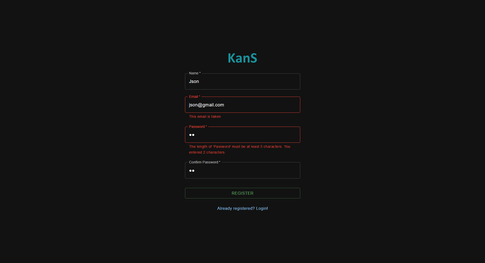

# KanS
KanS - Kanban System for managing boards and tasks for you and your team.

# Table of contents
- [KanS](#kans)
- [Table of contents](#table-of-contents)
- [General info](#general-info)
- [Technologies](#technologies)
  - [Backend](#backend)
  - [Frontend](#frontend)
- [Showcase](#showcase)

# General info
KanS is a web application developed as my individual project during my second year of Computer Science studies at Warsaw University of Technology. Designed to streamline and enhance team collaboration, KanS offers a comprehensive solution for managing kanban boards.

With KanS, users can register and create their own boards, enabling seamless organization and tracking of tasks and projects. The intuitive interface allows for the creation of custom columns and cards within each board, facilitating efficient task management.

One of KanS's standout features is its ability to foster teamwork. Users have the option to invite team members to collaborate on boards, promoting seamless communication among team members.

The application is developed using C#, React, and PostgreSQL.

 

# Technologies

## Backend
- C# .NET 6
- Entity Framework Core
- PostgreSQL
- AutoMapper
- FluentValidation
- Swagger
- JWT

## Frontend
- React
- React Router
- React Redux
- Material UI
- Axios
- JWT Decode
- React Beautiful DND

# Showcase

